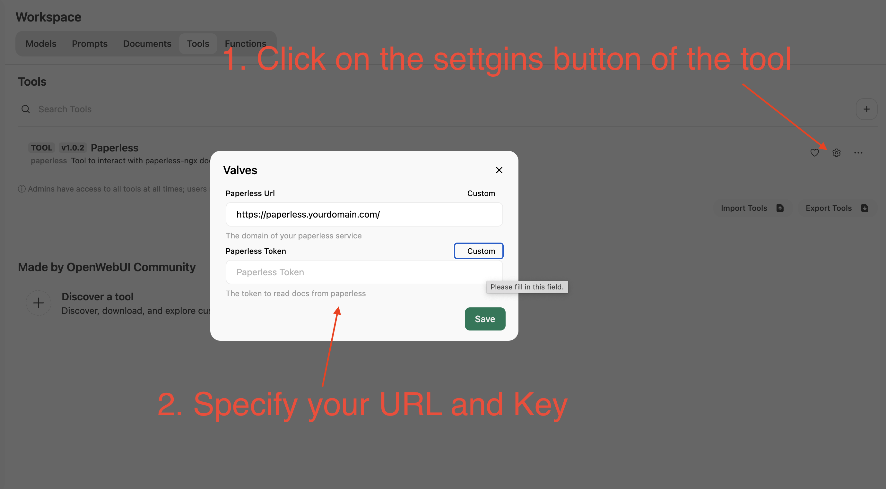
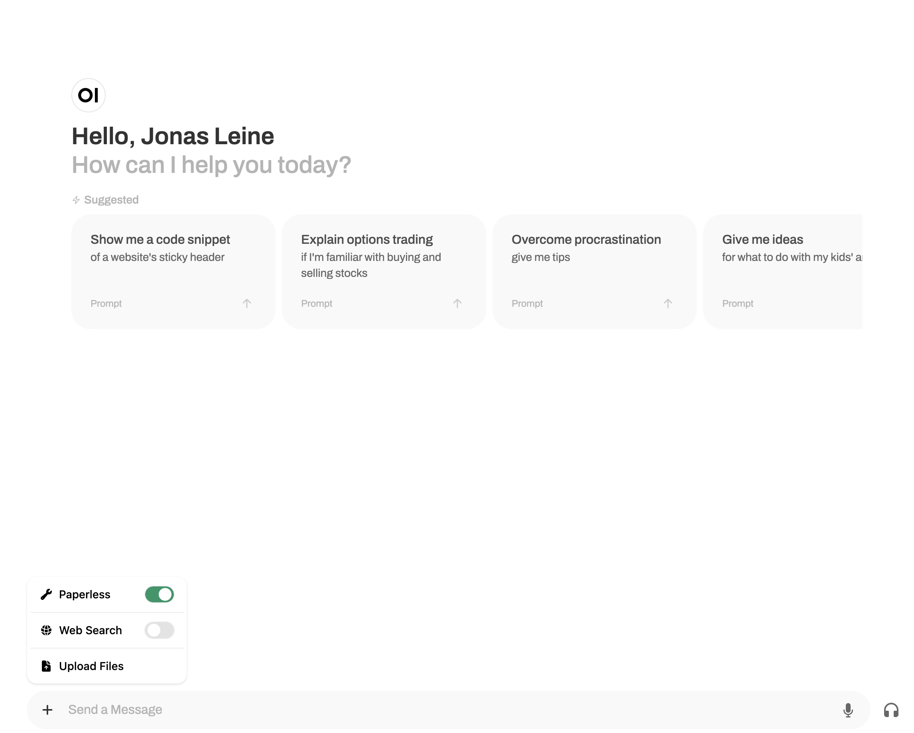
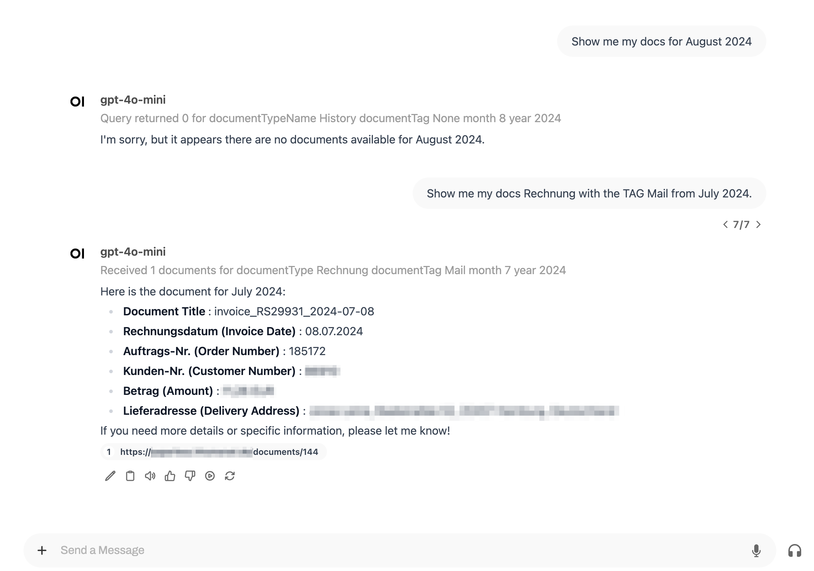

# open-webui-tools

This repo contains extensions for OpenWebUI, a UI client for LLMs. It contains tools I've developed mainly for my own
use. Feel free to contribute whenever you like.

## Tool: Paperless

This tool provides access to a running Paperless instance. Using REST the LLM is able to load any given document as long
as it has a certain DocumentType and/or TAG.

Once installed you need to configure two things to run it.

* the URL of your running Paperless instance
* a valid key to query Paperless via REST (I prefer to use a new user account with read-only access)

Then you need to administrate the model so that it has access to this tool. After that you can start a new chat and
activate the tool as you like.

The following screenshots demonstrate how to use it.

Set the tool values to your paperless instance

Activate the tool whenever you need

This last screenshot just shows how to use the tool. As you can see, it always prints out the arguments it uses to query
to make a paperless request via REST. You can check your OpenWeb UI instance logs for more details.